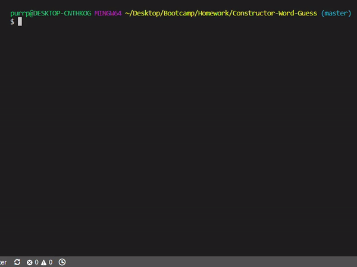

# Constructor-Word-Guess
* This is a command line Word Guess game using node. 
* The Datamuse API gets words related to the category you choose and selects one for you to guess.
---
### Demo

---
### To use this project
* Clone the repository
* Run `npm i` in the terminal
* Run `node index.js` to play the game
---
### Tools used in this project
* [Datamuse API](https://www.datamuse.com/api/)
* [npm Inquirer](https://www.npmjs.com/package/inquirer)
